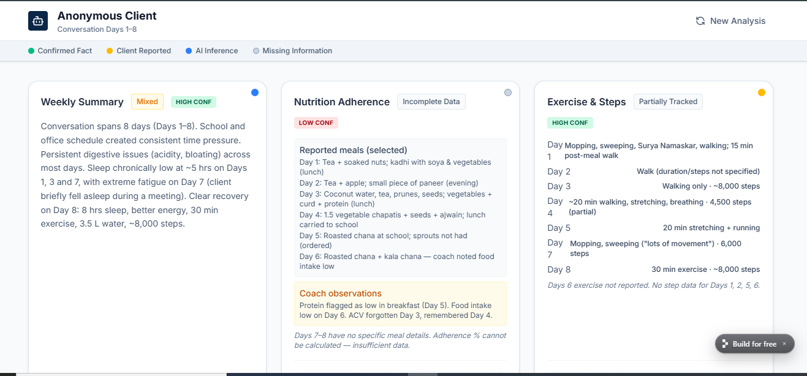
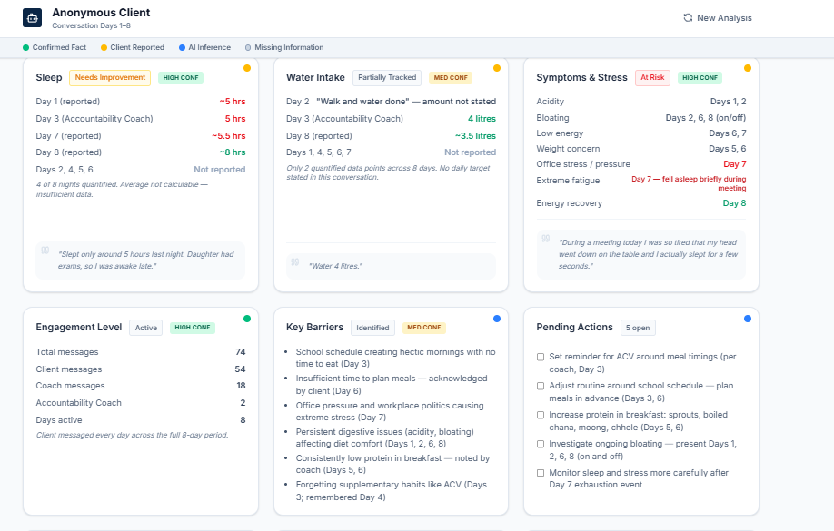
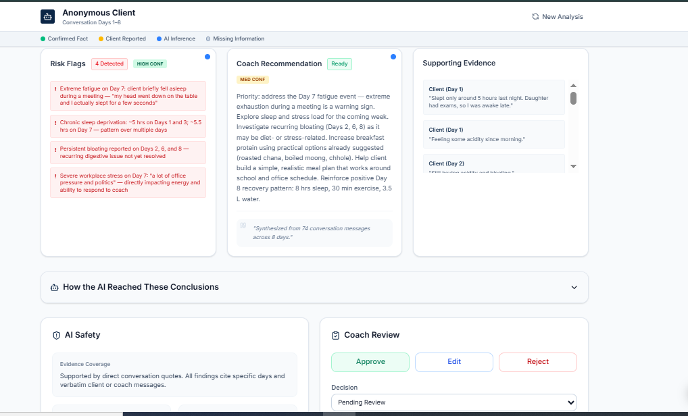
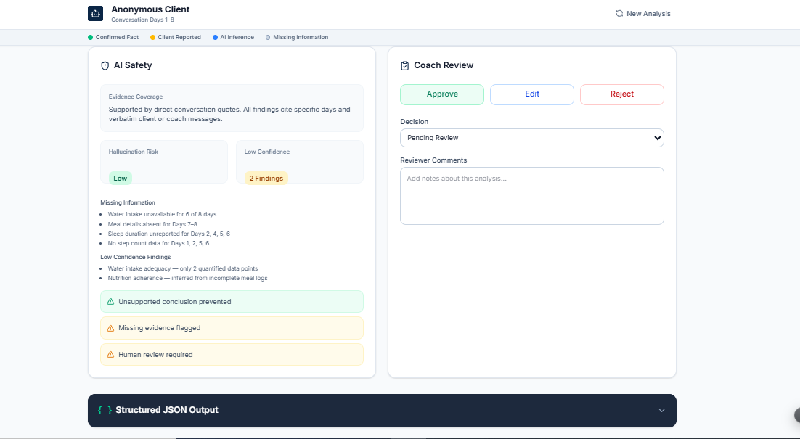

# FUME AI Client Intelligence

> AI-powered client intelligence dashboard prototype for coaching conversations.

## 📖 Overview

FUME AI Client Intelligence is a frontend prototype developed for a GenAI Product Internship assignment.

The application demonstrates how AI can analyze WhatsApp-style conversations between a coach and a client, automatically extracting meaningful health insights and presenting them in an interactive dashboard.

---
## 📸 Screenshots

### Hero Dashboard

### Input Conversation

### AI Processing Pipeline

### Dashboard Cards

## ✨ Features

- 📊 Weekly Client Summary
- 🥗 Nutrition Adherence
- 🏃 Exercise & Steps Tracking
- 😴 Sleep Analysis
- 💧 Water Intake Monitoring
- ❤️ Symptoms & Stress Detection
- 📈 Engagement Score
- 🚩 Risk Flags

---

## 🛠️ Tech Stack

- React
- TypeScript
- Tailwind CSS
- Replit

---

## 🎯 Purpose

This prototype showcases how Generative AI can assist coaches by converting unstructured conversations into actionable client intelligence.

---

## 📌 Status

✅ Prototype Completed

---

## 📄 License

MIT License
